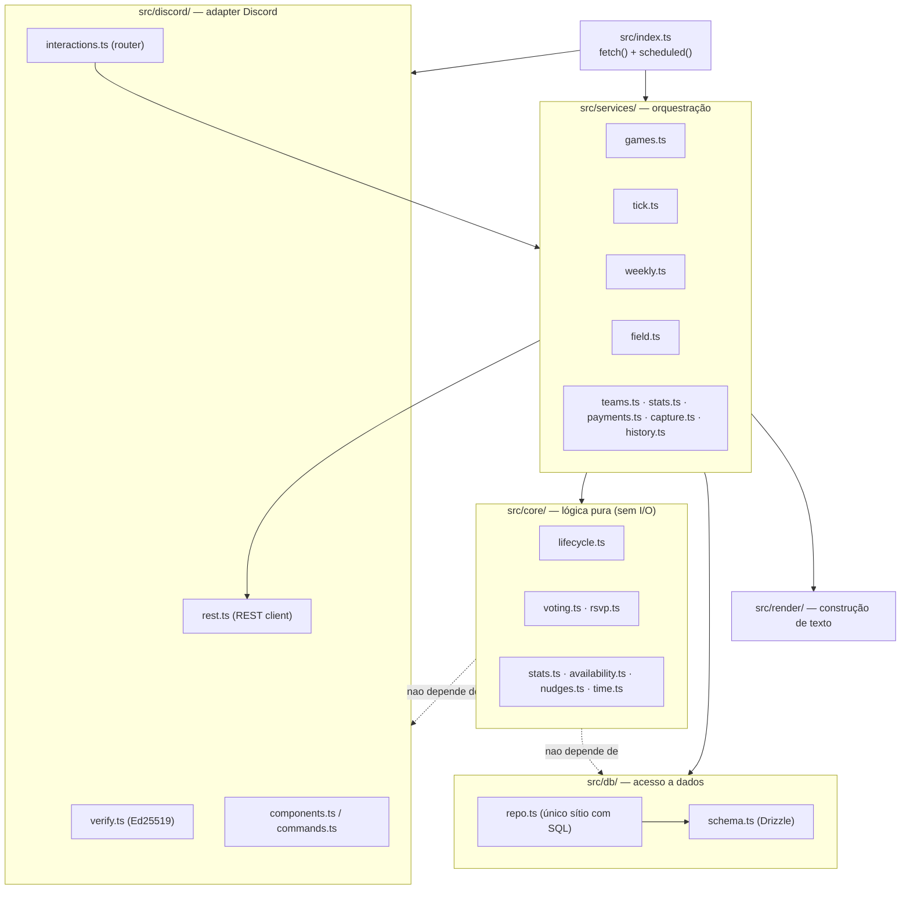
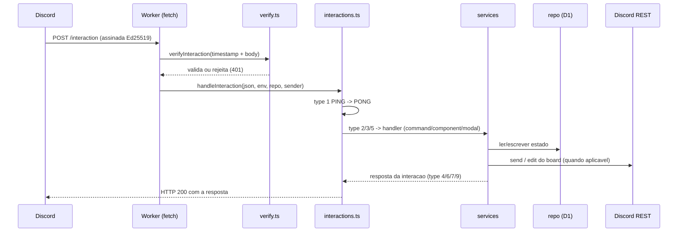

# Arquitetura

Visão de alto nível do sistema: a stack, o modelo de execução, as camadas e os dois fluxos
principais (interação HTTP e cron). Para o detalhe do domínio (state machine, stats, auto-jogo)
ver [system-design.md](system-design.md); para o esquema da base de dados ver
[data-model.md](data-model.md).

## Stack

| Camada | Tecnologia | Notas |
|---|---|---|
| Runtime | Cloudflare Workers | Sem servidor sempre-a-correr; corre por evento (HTTP ou cron) |
| Persistência | Cloudflare D1 (SQLite) | Binding `DB` em `wrangler.toml` |
| ORM | Drizzle ORM | Única dependência de runtime (`drizzle-orm`) |
| Agendamento | Cloudflare Cron Triggers | `crons = ["* * * * *"]` — corre o `scheduled()` a cada minuto |
| Interface | Discord HTTP Interactions | Slash commands, buttons, selects e modais |
| Linguagem | TypeScript (ES2022, strict) | `tsc --noEmit` no typecheck; bundle pelo Wrangler |
| Integração externa | Firestore público do getfield.app | Leitura de disponibilidade do campo (sem login) |

O bot não tem framework de servidor nem dependências pesadas: a verificação de assinatura usa
a Web Crypto API nativa do runtime e o acesso à Discord REST API é um wrapper de `fetch`.

## Modelo de execução

Tudo vive num único Worker com dois entry points em `src/index.ts`:

- **`fetch(request, env)`** — recebe os HTTP interactions que o Discord envia por webhook.
  Verifica a assinatura, faz parse do payload e encaminha para o handler certo. Responde de
  forma síncrona dentro do mesmo pedido.
- **`scheduled(controller, env)`** — disparado pelo Cron Trigger a cada minuto. Corre o
  `runTick()`, que avança as transições por tempo (deadlines, nudges, check-in) e, quando não
  há jogo ativo, abre a sondagem seguinte.

Não há estado em memória entre invocações: o estado vive todo na D1. Cada invocação cria um
`repo` (acesso à base de dados) e um `sender` (cliente Discord REST) a partir do `env`.

## Camadas e regra de dependência

O código está organizado em camadas com uma regra de dependência clara: a lógica pura não
conhece nem o Discord nem a base de dados. Isto torna a lógica de domínio testável sem I/O
(é o que o `selftest` explora).



Resumo das responsabilidades:

| Camada | Pasta | Responsabilidade | Depende de |
|---|---|---|---|
| Entry point | `src/index.ts` | Recebe `fetch`/`scheduled`, monta `repo` + `sender` | discord, services |
| Adapter Discord | `src/discord/` | Verificação de assinatura, routing, REST, componentes | core, db, render |
| Orquestração | `src/services/` | Liga lógica pura + base de dados + Discord por caso de uso | core, db, render |
| Lógica pura | `src/core/` | Votação, RSVP, state machine, stats, datas, disponibilidade | nada (sem I/O) |
| Acesso a dados | `src/db/` | Schema Drizzle e repository (todas as queries) | — |
| Render | `src/render/` | Constrói o texto markdown das mensagens | core (tipos) |
| Texto | `src/messages.ts` | Todas as frases em pt-PT, centralizadas | — |

## Fluxo de uma interação HTTP

Quando alguém corre um slash command, carrega num botão ou submete um modal, o Discord faz um
POST ao Worker. O caminho é:



Tipos de interação tratados em `src/discord/interactions.ts`: `1` PING, `2` slash command,
`3` componente (button/select), `5` submit de modal. As respostas usam os tipos do Discord:
`4` mensagem nova (muitas vezes ephemeral), `6` ack silencioso, `7` editar a mensagem do
componente, `9` abrir modal.

A edição dos boards vivos (votação, presenças, check-in) é feita por REST `PATCH` à mensagem
já publicada, não por repost — ver a secção "Edição de boards" em
[system-design.md](system-design.md).

## Fluxo do cron (tick)

O `scheduled()` corre `runTick()` a cada minuto (`src/services/tick.ts`). Carrega os jogos
ativos, avalia transições por tempo e, no fim, tenta abrir o jogo seguinte.

```mermaid
sequenceDiagram
  participant C as Cron (1/min)
  participant W as Worker (scheduled)
  participant T as runTick
  participant DB as repo (D1)
  participant F as field.pt (Firestore)
  participant API as Discord REST

  C->>W: scheduled()
  W->>T: runTick(now)
  T->>DB: getActiveGames()
  loop por cada jogo ativo
    T->>T: votacao expirou? RSVP fechou? kickoff? check-in fechou?
    T->>API: fechar votacao / abrir check-in / recap / nudges
  end
  T->>DB: getCurrentGame() / getLastGameCreatedAt()
  alt sem jogo ativo, 09-23h Lisbon, cooldown 12h ok
    T->>F: loadFreeSlots()
    T->>API: createGame() (nova sondagem; pinga o cargo Jogador)
  end
```

O tick é idempotente: cada transição é guardada por estado ou por uma flag na linha do jogo,
por isso correr o tick duas vezes no mesmo minuto não duplica mensagens. Um erro num jogo é
apanhado e registado (`console.error('[tick] game', id, e)`) sem parar os restantes.

## Onde está cada coisa

| Ficheiro | O que faz |
|---|---|
| `src/index.ts` | Entry points `fetch` e `scheduled`; verificação de assinatura |
| `src/discord/verify.ts` | Verificação Ed25519 + replay protection |
| `src/discord/interactions.ts` | Router de commands, componentes e modais |
| `src/discord/rest.ts` | Cliente REST (`send`/`edit`) e `allowedMentions` |
| `src/discord/components.ts` | Encode/decode dos `custom_id` e builders de botões/selects |
| `src/discord/commands.ts` | Definição dos slash commands (registados via script) |
| `src/services/games.ts` | Orquestração do ciclo de vida do jogo |
| `src/services/tick.ts` | O relógio: transições por tempo + abertura do jogo seguinte |
| `src/services/weekly.ts` | Auto-jogo event-driven (guards + `createGame`) |
| `src/services/field.ts` | Leitura do Firestore do field.pt |
| `src/core/lifecycle.ts` | Predicados da state machine |
| `src/core/stats.ts` | Agregação de estatísticas (pura) |
| `src/core/availability.ts` | Cálculo de slots livres (puro) |
| `src/db/repo.ts` | Único sítio com SQL |
| `src/db/schema.ts` | Tabelas Drizzle |
| `src/messages.ts` | Texto pt-PT centralizado |
