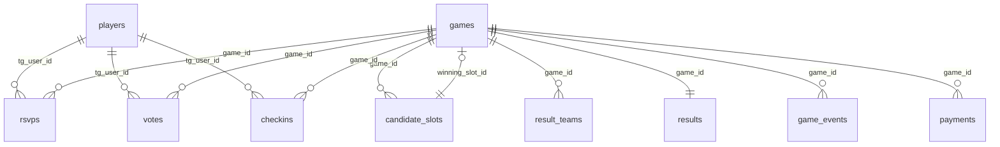

# Modelo de dados

Toda a persistência vive numa base de dados Cloudflare D1 (SQLite). A definição das tabelas
está em `src/db/schema.ts` (Drizzle ORM) e tem de se manter em sincronia com os ficheiros de
`migrations/`. As queries vivem todas em `src/db/repo.ts` — nenhum outro módulo corre SQL.

## Diagrama

As relações são todas por `game_id` (e por `tg_user_id` para o jogador). Não há foreign keys
declaradas no SQLite; a integridade é mantida pelo repository.

## Tabelas

### players
Um registo por utilizador de Discord visto pelo bot.

| Coluna | Tipo | Notas |
|---|---|---|
| `tg_user_id` | TEXT PK | Discord user id (snowflake) |
| `display_name` | TEXT | Nome a mostrar |
| `username` | TEXT | Pode ser null |
| `is_admin` | INTEGER (bool) | Derivado de `ADMIN_IDS` |
| `created_at` | INTEGER | unix ms |

### games
O agregado central. Uma linha por jogo, com o estado e os deadlines do ciclo de vida.

| Coluna | Tipo | Notas |
|---|---|---|
| `id` | INTEGER PK AI | Id interno |
| `chat_id` | TEXT | Discord channel id |
| `created_by` | TEXT | Quem abriu (admin ou `system` no auto-jogo) |
| `status` | TEXT | `GameStatus` (ver [system-design.md](system-design.md)) |
| `location_note` | TEXT | Local do jogo |
| `min_players` / `cap_players` | INTEGER | Mínimo para confirmar / máximo no squad |
| `vote_deadline` | INTEGER | unix ms; fim da votação |
| `rsvp_close_at` | INTEGER null | Fim das inscrições (definido ao trancar o vencedor) |
| `checkin_close_at` | INTEGER null | Fim da janela de check-in (kickoff + janela) |
| `winning_slot_id` | INTEGER null | Slot vencedor |
| `vote_msg_id` / `rsvp_msg_id` / `checkin_msg_id` / `teams_msg_id` / `payment_msg_id` | TEXT null | Ids das mensagens-board vivas |
| `teams_locked_at` | INTEGER null | Quando o admin publicou as equipas |
| `price_per_person_cents` | INTEGER null | Preço por pessoa em cêntimos (null = por definir) |
| `flag_game_on_sent` / `flag_short_warn_sent` / `flag_nonresp_ping_sent` | INTEGER (bool) | Guardas exactly-once dos nudges |
| `created_at` / `updated_at` | INTEGER | unix ms |

### candidate_slots
As opções de horário votáveis de um jogo.

| Coluna | Tipo | Notas |
|---|---|---|
| `id` | INTEGER PK AI | Id interno (referido por `games.winning_slot_id`) |
| `game_id` | INTEGER | |
| `kickoff_at` | INTEGER | unix ms da hora de jogo |
| `label` | TEXT | Etiqueta pt-PT pré-calculada, ex. `Sáb, 14 jun · 20:00` |
| `sort_order` | INTEGER | Ordem de apresentação |

### votes
Voto por aprovação: um jogador pode votar em vários slots. PK composta `(game_id, slot_id, tg_user_id)`.

| Coluna | Tipo |
|---|---|
| `game_id` | INTEGER |
| `slot_id` | INTEGER |
| `tg_user_id` | TEXT |
| `created_at` | INTEGER |

### rsvps
A resposta de presença de cada jogador. PK `(game_id, tg_user_id)`.

| Coluna | Tipo | Notas |
|---|---|---|
| `game_id` | INTEGER | |
| `tg_user_id` | TEXT | |
| `status` | TEXT | `IN` / `OUT` / `MAYBE` |
| `rank_at` | INTEGER | Hora a que (última vez) entrou como IN — ordena a lista de espera |
| `promoted_notified_at` | INTEGER null | Quando foi avisado da subida da lista de espera |
| `updated_at` | INTEGER | |

### checkins
Presença efetiva. Uma linha = este jogador esteve neste jogo. PK `(game_id, tg_user_id)`.

| Coluna | Tipo | Notas |
|---|---|---|
| `game_id` | INTEGER | |
| `tg_user_id` | TEXT | |
| `checked_in_at` | INTEGER | |
| `source` | TEXT | `self` (carregou) ou `admin` (admin limpou falso fantasma) |

### result_teams
A equipa de cada jogador num jogo. PK `(game_id, tg_user_id)`.

| Coluna | Tipo | Notas |
|---|---|---|
| `game_id` | INTEGER | |
| `tg_user_id` | TEXT | |
| `side` | TEXT | `A` (Alpha) ou `B` (Beta) |

### results
O placar. Uma linha por jogo com resultado. PK `game_id`.

| Coluna | Tipo | Notas |
|---|---|---|
| `game_id` | INTEGER PK | |
| `goals_a` / `goals_b` | INTEGER | Golos de Alpha / Beta |
| `recorded_by` | TEXT | Admin que registou |
| `recorded_at` | INTEGER | |

### game_events
Eventos de golo e assistência. Append-only com `id` autoincrement, por isso "anular último"
apaga o maior `id` daquele tipo.

| Coluna | Tipo | Notas |
|---|---|---|
| `id` | INTEGER PK AI | |
| `game_id` | INTEGER | |
| `tg_user_id` | TEXT | |
| `kind` | TEXT | `G` (golo) ou `A` (assistência) |
| `created_at` | INTEGER | |

### payments
Quem pagou cada jogo. Presença da linha = pagou; ausência = deve. PK `(game_id, tg_user_id)`.

| Coluna | Tipo |
|---|---|
| `game_id` | INTEGER |
| `tg_user_id` | TEXT |
| `paid_at` | INTEGER |

## Convenção de ids

O projeto começou em Telegram, por isso os campos de id ainda se chamam `tgUserId`, `chatId`
e `*MsgId` — mas guardam ids de Discord (snowflakes de 64 bits). Como esses valores
ultrapassam a precisão de um número JavaScript, são guardados como **TEXT**. Os ids internos
(`games.id`, `candidate_slots.id`, `winning_slot_id`) são **INTEGER AUTOINCREMENT**. Todos os
timestamps são unix ms em UTC; a conversão para hora de Lisboa acontece só em `src/core/time.ts`.

## Migrações

As migrações vivem em `migrations/`, são append-only e versionadas. Aplicam-se com
`npm run db:migrate:local` (D1 local) e `npm run db:migrate:remote` (produção). Nunca se editam
migrações já aplicadas — adiciona-se uma nova.

| Migração | O que adicionou |
|---|---|
| `0000_init.sql` | Ciclo base: `players`, `games`, `candidate_slots`, `votes`, `rsvps` (+ índices) |
| `0001_stats.sql` | `checkins` e as colunas de check-in em `games` (v2) |
| `0002_results.sql` | `result_teams`, `results` e colunas de equipas em `games` (v3) |
| `0003_game_events.sql` | `game_events` — golos e assistências (v4) |
| `0004_payments.sql` | `payments` e colunas de preço/board em `games` (v5) |

## Padrão repository

`src/db/repo.ts` é o único módulo que corre SQL; os services chamam métodos do repo, nunca
fazem queries diretas. Uma consequência de design importante: o squad confirmado **não é
escrito** numa tabela — é derivado a pedido a partir das linhas `rsvps` (filtra os IN, ordena
por `rank_at`, corta no `cap`). Isto evita corridas pelo último lugar e mantém a lista de
espera consistente: quem sobe é sempre o IN mais antigo a seguir ao corte.
