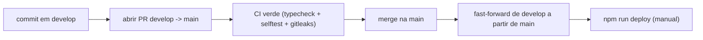

# Desenvolvimento e release

Como pôr o projeto a correr localmente, testar, e levar uma mudança até produção.

## Setup local

```bash
cp .dev.vars.example .dev.vars     # preencher com os valores reais (gitignored)
npm install
npm run register                   # cria os slash commands no servidor (instantâneo)
npm run db:migrate:local           # cria as tabelas na D1 local
npm run dev                        # wrangler dev (endpoint HTTP local)
```

O `.dev.vars` precisa de `DISCORD_BOT_TOKEN`, `DISCORD_PUBLIC_KEY`, `DISCORD_APPLICATION_ID`,
`DISCORD_GUILD_ID` (id do servidor) e `ADMIN_IDS` (o teu user id). Ver
[configuration.md](configuration.md) para o que cada um faz.

Como o bot funciona por HTTP interactions, o Discord precisa de um URL público para o chamar —
não corre como um long-poll local. Para testar a lógica sem Discord usa-se o `selftest`; o
teste com o Discord real faz-se com o deploy.

## Testing

Não há framework de unit tests. A rede de segurança é um self-test de integração:

```bash
npm run selftest      # simula o ciclo todo com um Sender falso + D1 local
npm run typecheck     # tsc --noEmit
```

O `selftest` (`scripts/selftest.ts`) usa um `Sender` falso (que regista as mensagens em vez de
as enviar) e a D1 local com as migrações aplicadas, e percorre o ciclo completo:
votação -> vencedor -> presenças -> lista de espera -> promoção -> fecho -> check-in ->
fantasma -> admin-clear -> equipas -> resultado -> `/stats`. Também exercita as funções puras
(parsing de datas, formatação pt-PT, disponibilidade, apuramento de votos, stats). É o
green gate: o que o `selftest` cobre é o que a CI corre.

## Integração contínua

`.github/workflows/ci.yml` corre em cada push e pull request para `main` e `develop`:

1. `npm run typecheck`
2. `npm run db:migrate:local`
3. `npm run selftest`
4. `gitleaks` (secret scanning — ver [security.md](security.md))

## Scripts utilitários

| Script | Comando | Para quê |
|---|---|---|
| Self-test | `npm run selftest` | Simular o ciclo sem Discord |
| Registar comandos | `npm run register` | Criar/atualizar os slash commands no servidor |
| Tabelas da D1 | `npm run db:tables` | Listar as tabelas da D1 local |
| Disponibilidade | `npm run print:avail` | Inspecionar a resposta do field.pt (debug) |

Para experimentar o fluxo de equipas/resultado sem juntar 14 pessoas, define `TEST_CHANNEL_ID`
e corre `/testjogo` nesse canal: cria um jogo já confirmado com jogadores falsos. As stats são
por canal, por isso isto nunca toca nos números do grupo. Sem `TEST_CHANNEL_ID` o comando fica
desligado.

## Secret scanning local (gitleaks)

O gitleaks corre na CI, mas convém corrê-lo antes de commitar. Instalação (qualquer uma):

```bash
go install github.com/gitleaks/gitleaks/v8@latest          # via Go
# ou descarregar o binário de github.com/gitleaks/gitleaks/releases
# ou, sem instalar, via Docker:
docker run -v "$PWD:/repo" zricethezav/gitleaks:latest detect --source=/repo
```

Uso:

```bash
gitleaks protect --staged     # varre o que está em staging (pre-commit)
gitleaks detect --source .    # varre o repositório todo
```

O `.gitleaks.toml` na raiz é lido automaticamente e isenta os valores públicos por design.

## Release flow

O fluxo é `develop` -> pull request -> `main`, com deploy manual. Não há deploy contínuo: o
`npm run deploy` é sempre feito à mão depois do merge.



Passos:

1. Trabalhar em `develop` (ou num branch que entra em `develop`).
2. Abrir o PR de `develop` para `main` e esperar a CI verde.
3. Fazer merge na `main`.
4. Atualizar `develop` por fast-forward a partir de `main`.
5. Correr `npm run deploy` para publicar o Worker.

## Deploy à Cloudflare

Primeira vez:

```bash
npx wrangler login
npx wrangler d1 create futbol-db        # copiar o database_id para o wrangler.toml
npm run db:migrate:remote               # migrar a D1 de produção
npx wrangler secret put DISCORD_BOT_TOKEN
npm run deploy                          # publica e devolve o URL do Worker
```

Depois, no Developer Portal do Discord (General Information -> Interactions Endpoint URL), colar o
URL do Worker e guardar; o Discord envia um PING de validação e o bot responde sozinho. O cron
do `wrangler.toml` trata dos avisos e prazos a cada minuto. Se mudares a lista de comandos,
corre `npm run register` outra vez.

O plano gratuito do Cloudflare Workers não pede cartão nem cobra: ultrapassados os limites
(improvável — são na ordem dos 100k pedidos/dia), simplesmente deixa de servir, nunca fatura.
