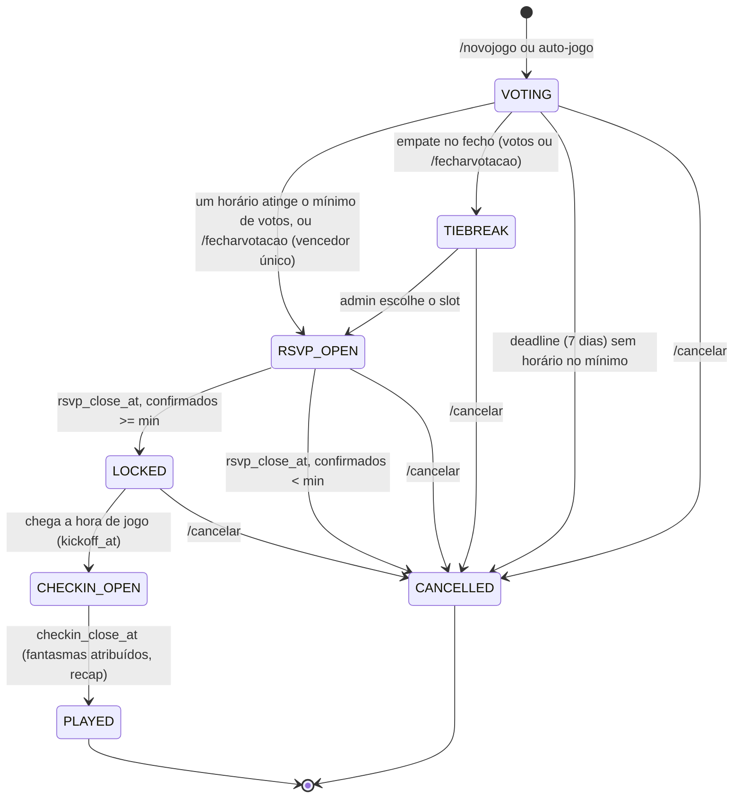
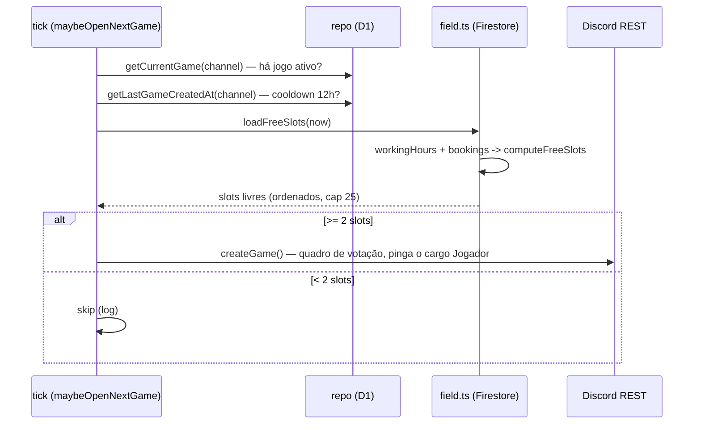

# System design

O detalhe do domínio: a máquina de estados do jogo, o tick que a move, o auto-jogo
event-driven, os nudges e o motor de estatísticas. Pressupõe a leitura da
[arquitetura](architecture.md).

## Máquina de estados do jogo

Um jogo é uma linha na tabela `games` com um campo `status`. O estado avança por duas forças:
ações de utilizador (taps, comandos) e o tempo (o tick compara `now` com os deadlines guardados
na linha). Os predicados estão em `src/core/lifecycle.ts`; a orquestração das transições em
`src/services/games.ts` e `src/services/tick.ts`.



Estados (`src/types.ts`):

| Estado | Significado | Sai por |
|---|---|---|
| `VOTING` | Quadro de votação publicado; o grupo carrega nos horários | um horário atingir o mínimo de votos, `/fecharvotacao`, ou o deadline (7 dias → cancela) |
| `TIEBREAK` | Votação fechada mas empatada; espera escolha do admin | ação do admin (button) |
| `RSVP_OPEN` | Vencedor definido; o grupo confirma presença | tempo (`rsvp_close_at`) |
| `LOCKED` | Inscrições fechadas; squad congelado | tempo (chegada do `kickoff_at`) |
| `CHECKIN_OPEN` | Hora de jogo passou; a recolher "Cheguei" | tempo (`checkin_close_at`) |
| `PLAYED` | Janela fechada; fantasmas atribuídos; stats finais | terminal |
| `CANCELLED` | Cancelado pelo sistema (prazo da sondagem sem mínimo de votos, RSVP ou horários expirados) | terminal |

`PLAYED`, `CANCELLED` e `CANCELLED_ADMIN` são terminais. Os estados ativos — os que o tick
processa — são `VOTING`, `TIEBREAK`, `RSVP_OPEN`, `LOCKED`, `CHECKIN_OPEN` (`GAME_STATUSES_ACTIVE`
em `src/config.ts`).

## O tick loop

`runTick()` corre uma vez por minuto. Para cada jogo ativo avalia, por esta ordem:

1. **Votação expirou** (`isVotingExpired`): o prazo (por omissão 7 dias após a abertura) chegou
   sem nenhum horário ter atingido o mínimo de votos — a sondagem é CANCELADA e o auto-jogo
   relança uma nova. (Uma sondagem só "ganha" mais cedo, no voto que leva um horário ao
   mínimo, ou por `/fecharvotacao`.)
2. **`RSVP_OPEN`**: se `isRsvpExpired`, fecha as inscrições (`closeRsvp`) — congela o squad e
   passa a `LOCKED`, ou cancela se houver menos confirmados do que o mínimo. Se ainda não
   expirou, avalia os nudges (`processNudges`).
3. **`LOCKED`**: se já passou o `kickoffAt` do slot vencedor, abre o check-in (`openCheckin`)
   e passa a `CHECKIN_OPEN`.
4. **`CHECKIN_OPEN`**: se `isCheckinExpired`, fecha a janela (`closeCheckin`) — atribui
   fantasmas, publica o recap e passa a `PLAYED`.

`TIEBREAK` não tem transição por tempo: espera a escolha do admin.

No fim, fora do ciclo, corre `maybeOpenNextGame()` — o auto-jogo (abaixo).

**Idempotência.** O tick é seguro de repetir: as transições dependem do estado atual (que muda
ao transitar) e os nudges são guardados por flags exactly-once na linha do jogo
(`flagGameOnSent`, `flagShortWarnSent`, `flagNonrespPingSent`). Um erro num jogo é apanhado e
registado sem afetar os outros.

## Nudges

`src/core/nudges.ts` é uma função pura que decide que avisos estão "due" para um jogo em
`RSVP_OPEN`, dado o número de confirmados e o tempo até ao fecho (`rsvp_close_at - now`):

| Nudge | Condição | Dispara uma vez via |
|---|---|---|
| `GAME_ON` | confirmados >= mínimo | `flagGameOnSent` |
| `SHORT_WARN` | confirmados < mínimo e faltam <= 6h para o fecho | `flagShortWarnSent` |
| `NONRESP_PING` | faltam <= 12h para o fecho | `flagNonrespPingSent` |

As janelas (`SHORT_WARN_BEFORE_CLOSE_MS`, `NONRESP_PING_BEFORE_CLOSE_MS`) estão em
`src/config.ts`. O `NONRESP_PING` menciona quem ainda não respondeu.

## Auto-jogo event-driven (field.pt)

Em vez de um horário fixo, a sondagem do jogo seguinte abre **assim que não há jogo ativo no
canal** — ou seja, logo que o anterior foi jogado (`PLAYED`), caiu por falta de gente
(`CANCELLED`) ou foi cancelado pelo admin (`CANCELLED_ADMIN`). Isto dá ao grupo o máximo de
antecedência. A lógica está em
`src/services/weekly.ts` (`maybeOpenNextGame`), com as guardas em `src/config.ts`.

Guardas, todas verificadas antes de abrir:

- `channelId` definido (`GAME_CHANNEL_ID`); vazio desliga a feature.
- Dentro do horário diurno: `09:00 <= hora Lisbon < 23:00` (`isAutoOpenHour`), para não pingar
  o grupo de madrugada quando um jogo acaba tarde.
- Não há jogo em progresso no canal (`getCurrentGame`) — dedup.
- Passaram pelo menos 12h desde o último jogo aberto (`getLastGameCreatedAt` +
  `AUTO_OPEN_COOLDOWN_MS`).
- Há pelo menos 2 slots livres à frente (senão não vale a pena votar).



### Cálculo de slots livres

`src/services/field.ts` lê o Firestore público do getfield.app (`field-v2-prod`): o documento
do campo (working hours + blocked slots) e as marcações com estado "booked". Passa esses dados
decodificados a `computeFreeSlots()` (`src/core/availability.ts`), que é puro e:

- percorre os próximos `AVAIL_DAYS_AHEAD` dias (8);
- exclui os dias da regra do grupo: Sexta e Domingo (`WEEKLY_EXCLUDED_DOWS = [5, 7]`);
- aplica a janela horária `[AVAIL_EARLIEST_HOUR, AVAIL_LATEST_HOUR)` = `[18, 24)`, exceto ao
  Sábado, em que qualquer hora aberta vale (`AVAIL_ANY_HOUR_DOWS = [6]`);
- descarta slots que colidam com marcações ou blocks;
- ordena por hora e corta em `AVAIL_MAX_SLOTS` (25, o limite de botões do Discord).

**Nota de wall-clock.** O field.pt guarda as horas em wall-clock de Lisboa mas com sufixo `Z`
(que normalmente indicaria UTC). O `field.ts` interpreta as componentes como hora local de
Lisboa e converte para UTC via `src/core/time.ts`, em vez de confiar no `Z`.

## Motor de estatísticas

`src/core/stats.ts` é uma agregação pura: recebe as linhas em bruto (jogos `PLAYED`, RSVPs,
check-ins, equipas, resultados, eventos de golo/assist) e devolve um `PlayerStat` por jogador.
Aceita uma janela opcional `[since, until)` sobre o `kickoffAt`, usada para o recorte mensal.

### Definições

| Métrica | Definição |
|---|---|
| Presenças (appearances) | jogos `PLAYED` em que o jogador tem check-in (confirmado ou suplente) |
| Confirmed-for | jogos em que estava no squad confirmado final (IN, dentro do cap por ordem de chegada) |
| Fiabilidade (reliability) | present-while-confirmed / confirmed-for; só rankeado a partir de `MIN_GAMES_TO_RANK` (3) |
| Fantasma (ghost) | confirmado mas sem check-in |
| Sequência (streak) | jogos `PLAYED` consecutivos mais recentes em que apareceu; qualquer falha repõe a 0 |
| Early-bird | jogos em que foi o primeiro a dizer "Vou" (menor `rankAt` entre os IN) |
| V/E/D | vitórias/empates/derrotas em jogos com equipa atribuída e resultado registado |
| Win rate | vitórias / jogos-com-resultado; só rankeado a partir de `MIN_GAMES_FOR_WINRATE` (3) |
| Série de vitórias | vitórias consecutivas nos jogos-com-resultado do próprio jogador |
| Golos / assists | contagem a partir de `game_events` (sujeito às feature flags) |

O squad confirmado de cada jogo é derivado, não escrito: filtra os IN, ordena por `rankAt`
(hora de chegada) e corta no `cap`. Isto espelha o `splitSquad` do RSVP e garante consistência
entre o que foi confirmado e o que conta para as stats.

### Jogador do Mês

Sobre as stats do mês corrente, um score composto (`motmScore`) decide o Jogador do Mês:

```
score = 10 x presenças
      + 3  x melhor sequência do mês
      + round(5 x fiabilidade)        (fiabilidade = present-while-confirmed, 0..1)
      - 4  x fantasmas
```

Os pesos estão em `src/config.ts` (`MOTM_W_APPEARANCE`, `MOTM_W_STREAK`, `MOTM_W_RELIABILITY`,
`MOTM_W_GHOST`) e são inteiros para o resultado ser fácil de explicar ao grupo. Não se atribui
ninguém enquanto o mês não tiver pelo menos `MIN_GAMES_FOR_MOTM` (2) jogos, e o vencedor tem de
ter aparecido em pelo menos `MOTM_MIN_APPEARANCES` (2).

### Onde aparecem

As stats alimentam os comandos `/stats`, `/eu`, `/comparar`, `/topmarcadores` e `/historico`,
e o recap automático pós-jogo. Os boards (fiabilidade, presenças, sequências, fantasmas,
early-birds, registo perfeito, vitórias, win rate, série de vitórias, goleadores, assistências)
são seletores puros sobre o mesmo `Stats` (funções `topBy...` em `src/core/stats.ts`),
renderizados em `src/render/stats-message.ts`. Um board que ficaria vazio é omitido.

## Edição de boards

O padrão de UI é uma única mensagem viva por fase, editada via REST `PATCH` à medida que o
estado muda, em vez de repostar. O quadro de votação re-renderiza a contagem a cada voto; o de
presenças re-renderiza squad e lista de espera; o de check-in re-renderiza quem já chegou.

As respostas às interações são, na maioria, ephemeral (só quem carregou vê o "toast"), e a
atualização do board é uma operação separada. Isto evita corridas entre taps concorrentes: o
board reflete sempre o estado lido da base de dados, não o tap individual.
